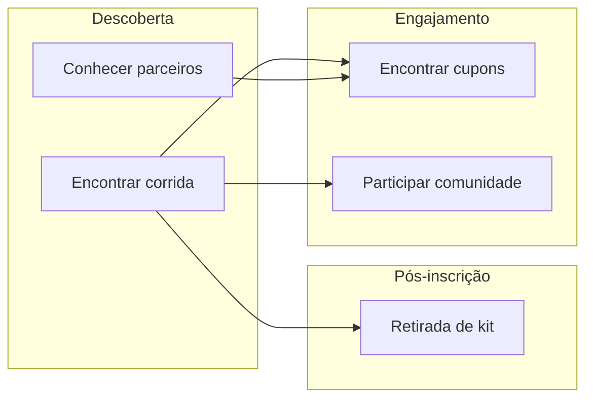

# User Journeys — Plataforma Corredora DF

**PB-028** · Documento oficial das jornadas do usuário.

| Campo | Valor |
|---|---|
| **Status** | Aprovado |
| **Versão** | 1.0 |
| **Última atualização** | 2026-07-13 |
| **Audiência** | UX, produto, engenharia e QA |

---

## 1. Introdução

Este documento descreve as **cinco jornadas centrais** da Plataforma Corredora DF do ponto de vista do usuário. Cada jornada mapeia intenção, caminho na interface, desvios possíveis, fricções e oportunidades — servindo como base para wireframes, desenvolvimento e testes E2E.

### 1.1 Como ler este documento

| Campo | Uso |
|---|---|
| **Objetivo** | O que o usuário quer realizar |
| **Perfil** | Persona principal (ver [product-vision.md](./product-vision.md)) |
| **Ponto de entrada** | Onde a jornada começa |
| **Fluxo principal** | Caminho feliz, passo a passo |
| **Fluxos alternativos** | Desvios válidos ou recuperação de erro |
| **Obstáculos** | Fricções atuais ou previstas |
| **Oportunidades** | Melhorias de UX e produto |
| **Indicadores de sucesso** | Como medir se a jornada funcionou |

### 1.2 Convenções

```text
→   passo seguinte
[ ] estado ou decisão do usuário
/   rota na aplicação
```

Rotas alinhadas ao menu em `DEFAULT_NAV_ITEMS` (`/corridas`, `/kits`, `/cupons`, `/parceiros`, `/comunidade`).

### 1.3 Mapa das jornadas



---

## 2. Jornada 1 — Encontrar uma corrida

### Nome
**Encontrar uma corrida**

### Objetivo
Descobrir um evento de corrida no DF adequado ao perfil do usuário, entender detalhes (data, distância, local, vagas) e, quando pronto, iniciar ou concluir a inscrição.

### Perfil do usuário
**Corredor iniciante** (primário) — busca provas acessíveis (5K, 10K), consulta pelo celular, ainda não tem conta.  
**Corredor experiente** (secundário) — compara opções no calendário local, pode já estar autenticado.

### Ponto de entrada

| Entrada | Contexto |
|---|---|
| `/` (Home) | Hero, evento em destaque ou seção “Próximas Corridas” |
| `/corridas` | Acesso direto via Navbar → Corridas |
| Busca orgânica / link externo | Landing em detalhe do evento (`/corridas/{slug}`) |
| Blog ou comunidade | Artigo ou post que menciona evento com link |

### Fluxo principal

```text
1. Usuário acessa a Home (/)
2. → Visualiza Hero e rola até "Evento em Destaque"
3. → Clica em "Ver evento" ou "Inscrever-se"
4. → Chega em /corridas/{slug}
5. → Lê informações: data, cidade, distância, status de inscrição, descrição
6. [ Já tem conta? ]
   Não → Clica "Inscrever-se" → Cadastro (/auth/register) → Login
   Sim → Clica "Inscrever-se"
7. → Confirma inscrição (POST /events/:id/register)
8. → Vê confirmação + próximos passos (kit, data da prova)
9. ✓ Jornada concluída — inscrição confirmada
```

**Fluxo alternativo via listagem:**

```text
1. Navbar → Corridas (/corridas)
2. → Aplica filtros (categoria, data, cidade, inscrições abertas)
3. → Compara cards de eventos
4. → Seleciona evento → continua do passo 5 do fluxo principal
```

### Fluxos alternativos

| Cenário | Caminho |
|---|---|
| Evento em destaque não interessa | Rola para "Próximas Corridas" ou vai a `/corridas` |
| Inscrições encerradas | Detalhe exibe status; CTA muda para "Ver outras corridas" ou lista de espera (futuro) |
| Usuário anônimo abandona no cadastro | Retorna depois via mesmo link; evento salvo em histórico local (futuro) |
| Vagas esgotadas | Mensagem clara (`EVENT_FULL`); sugere eventos similares |
| Já inscrito | Badge "Você já está inscrito" + link para kit e detalhes |
| Busca por distância | Filtro `category=5k` ou `10k` na listagem |

### Obstáculos

| Obstáculo | Impacto |
|---|---|
| Muitas opções sem filtro claro | Paralisia de escolha para iniciantes |
| Cadastro obrigatório na inscrição | Abandono no meio do funil |
| Informação desatualizada (data, vagas) | Perda de confiança |
| Detalhe do evento longo no mobile | Scroll excessivo até o CTA |
| Falta de indicação de nível (iniciante vs avançado) | Medo de escolher prova inadequada |

### Oportunidades de melhoria

- Badge **"Ideal para iniciantes"** em provas 5K/10K.
- **Filtros rápidos** na Home: "Este mês", "5K", "Inscrições abertas".
- **Salvar evento** (wishlist) sem login — captura intenção.
- **Compartilhar** link do evento (WhatsApp) a partir do detalhe.
- Notificação quando inscrições abrirem (usuário cadastrado).
- Recomendações baseadas em histórico (pós-MVP).

### Indicadores de sucesso

| Indicador | Definição | Meta indicativa |
|---|---|---|
| CTR Home → detalhe | Cliques em evento / visitantes na Home | ≥ 20% |
| CTR detalhe → inscrição | Inícios de inscrição / visualizações de detalhe | ≥ 15% |
| Taxa de conclusão de inscrição | Inscrições confirmadas / inícios | ≥ 70% |
| Tempo até decisão | Tempo entre chegada ao detalhe e clique em inscrever | < 3 min (mediana) |
| Abandono no cadastro | Usuários que iniciam cadastro e não concluem inscrição | < 40% |

**North Star relacionada:** inscrições confirmadas em eventos por mês ([product-vision.md](./product-vision.md)).

**Rotas:** `/`, `/corridas`, `/corridas/{slug}` · **Feature:** `features/events/` · **API:** [events.md](../api/events.md)

---

## 3. Jornada 2 — Solicitar retirada de kit

### Nome
**Solicitar retirada de kit**

### Objetivo
Saber onde, quando e como retirar o kit de corrida após a inscrição — e confirmar que está tudo pronto para o dia da prova.

> **Nota de escopo:** no MVP, "solicitar" significa **consultar informações de retirada e status do kit** vinculado à inscrição. Agendamento de horário ou fila virtual são evoluções pós-MVP.

### Perfil do usuário
**Corredor iniciante ou experiente** — já inscrito em pelo menos um evento, autenticado. Acessa próximo à data da prova, frequentemente pelo celular.

### Ponto de entrada

| Entrada | Contexto |
|---|---|
| `/kits` | Navbar → Retirada de Kits |
| `/` (Home) | Seção "Retirada de Kits" (kits pendentes) |
| `/corridas/{slug}` | Após inscrição — bloco "Seu kit" |
| Notificação | `event_reminder` ou comunicação de organizador |
| E-mail / WhatsApp | Link direto para kit do evento |

### Fluxo principal

```text
1. Usuário logado acessa /kits
2. → Vê lista de kits pendentes de retirada (evento, data, local, status)
3. → Seleciona kit do evento desejado
4. → Abre detalhe: /kits/{id} ou /corridas/{slug}/kit
5. → Confere itens do kit (camiseta, número, medalha)
6. → Confere local, data e horário de retirada
7. → Confere documentos necessários (RG, comprovante de inscrição)
8. [ Tamanho de camiseta já informado? ]
   Não → Seleciona tamanho e salva
   Sim → Prossegue
9. → Marca mentalmente / salva informação
10. ✓ Jornada concluída — usuário sabe quando e onde retirar
```

### Fluxos alternativos

| Cenário | Caminho |
|---|---|
| Usuário não logado | `/kits` exibe explicação do processo + CTA "Entrar" ou "Cadastrar-se" |
| Sem inscrições ativas | Empty state: "Você não tem kits pendentes" + CTA "Explorar corridas" |
| Múltiplos eventos | Lista ordenada por data de retirada mais próxima |
| Kit ainda não disponível | Status "Em preparação" + data prevista de liberação |
| Dúvida não resolvida | Link para Concierge (/concierge) ou FAQ |
| Retirada por terceiros | Instruções em texto (procuração, documentos) — conteúdo estático no MVP |

### Obstáculos

| Obstáculo | Impacto |
|---|---|
| API sem janela de retirada (gap atual) | Informação incompleta frustra usuário |
| Usuário não associa inscrição → kit | Não encontra o que procura |
| Local de retirada difícil no mapa | Atraso ou desistência no dia |
| Tamanho de camiseta não escolhido a tempo | Problema operacional no evento |
| Anônimo não vê utilidade da seção na Home | Seção ignorada antes da primeira inscrição |

### Oportunidades de melhoria

- **Lembrete push/e-mail** 48h antes da janela de retirada.
- **Mapa integrado** (Google Maps) no detalhe do local.
- **QR code** de confirmação de retirada no dia (check-in).
- Escolha de tamanho **no fluxo de inscrição** (reduz passo posterior).
- Card na Home com **próxima retirada** em destaque para logados.
- Campos `pickupLocation`, `pickupStart`, `pickupEnd` na API de kits.

### Indicadores de sucesso

| Indicador | Definição | Meta indicativa |
|---|---|---|
| Taxa de consulta pós-inscrição | Usuários inscritos que visitam /kits antes da prova | ≥ 60% |
| Tempo até primeira consulta | Dias entre inscrição e primeira visita à área de kits | ≤ 3 dias |
| Conclusão de tamanho | % inscrições com tamanho de camiseta definido antes da retirada | ≥ 90% |
| Tickets de suporte sobre kit | Dúvidas via Concierge sobre local/horário | Redução mês a mês |
| No-show na retirada | Retiradas não realizadas / kits disponibilizados | Monitorar (organizador) |

**Rotas:** `/kits`, `/kits/{id}`, `/corridas/{slug}/kit` · **Feature:** `features/events/` + seção Home · **API:** [kits.md](../api/kits.md), [events.md](../api/events.md)

---

## 4. Jornada 3 — Encontrar cupons

### Nome
**Encontrar cupons**

### Objetivo
Descobrir benefícios disponíveis (descontos em inscrições, produtos de parceiros), entender condições e resgatar cupons para usar em eventos ou compras parceiras.

### Perfil do usuário
**Corredor experiente** (primário) — busca economia e conhece o ecossistema.  
**Corredor iniciante** (secundário) — atrai-se por desconto na primeira inscrição.

### Ponto de entrada

| Entrada | Contexto |
|---|---|
| `/cupons` | Navbar → Cupons |
| `/` (Home) | Seção "Cupons" (teaser ou cupons reais) |
| `/parceiros/{slug}` | Benefícios listados no detalhe do parceiro |
| `/corridas/{slug}` | Cupom aplicável no checkout da inscrição (futuro) |
| Notificação | `coupon_available` |

### Fluxo principal

```text
1. Usuário autenticado acessa /cupons
2. → Vê lista de cupons ativos (título, desconto, parceiro, validade)
3. → Seleciona cupom de interesse
4. → Abre detalhe: /cupons/{id}
5. → Lê regras: eventos elegíveis, validade, tipo de desconto
6. → Clica "Resgatar" (POST /coupons/:id/redeem)
7. → Vê confirmação + código ou status "Resgatado"
8. [ Vai usar agora? ]
   Sim → Navega para evento elegível ou site do parceiro
   Não → Cupom fica em "Meus cupons" para uso posterior
9. ✓ Jornada concluída — cupom resgatado
```

### Fluxos alternativos

| Cenário | Caminho |
|---|---|
| Visitante anônimo na Home | Vê teaser (sem código) → "Cadastrar-se para resgatar" |
| Anônimo em `/cupons` | Redirect para login com returnUrl |
| Cupom expirado | Listagem filtra `status=active`; expirados em aba separada |
| Cupom já resgatado | Badge "Resgatado" + data de resgate |
| Validar código manual | Formulário "Tenho um código" → POST /coupons/validate |
| Cupom vinculado a parceiro | Fluxo Parceiros → detalhe → cupom (Jornada 4 → 3) |
| Sem cupons disponíveis | Empty state + CTA "Conhecer parceiros" |

### Obstáculos

| Obstáculo | Impacto |
|---|---|
| API restrita a autenticados | Anônimo não experimenta valor antes do cadastro |
| Regras de elegibilidade pouco claras | Resgate sem uso efetivo; frustração |
| Cupom não aplicável no checkout | Quebra de expectativa na inscrição |
| Muitos cupons genéricos | Baixa percepção de exclusividade |
| Validade curta sem aviso | Cupom expira antes do uso |

### Oportunidades de melhoria

- **Cupons em destaque** públicos na Home (endpoint `GET /coupons/featured`).
- **Aplicar cupom no fluxo de inscrição** com preview do desconto.
- Contador de **"Expira em X dias"** nos cards.
- Notificação quando novo cupom de parceiro favorito.
- Cupom de **boas-vindas** automático no cadastro.
- Histórico de cupons usados no perfil.

### Indicadores de sucesso

| Indicador | Definição | Meta indicativa |
|---|---|---|
| Taxa de resgate | Cupons resgatados / cupons exibidos | ≥ 30% |
| Taxa de uso pós-resgate | Cupons usados em inscrição ou parceiro / resgatados | ≥ 50% |
| Cadastros via seção de cupons | Novos usuários com source=cupons_home | Baseline + crescimento |
| Tempo até resgate | Entre visualização e clique em resgatar | < 2 min |
| Cupons por usuário ativo | Média de resgates por MAU | Monitorar engajamento |

**Rotas:** `/cupons`, `/cupons/{id}` · **Feature:** `features/coupons/` · **API:** [coupons.md](../api/coupons.md)

---

## 5. Jornada 4 — Conhecer parceiros

### Nome
**Conhecer parceiros**

### Objetivo
Descobrir marcas e serviços do ecossistema de corrida no DF, entender benefícios oferecidos e aprofundar no parceiro de interesse — eventualmente levando a cupons ou eventos patrocinados.

### Perfil do usuário
**Corredor iniciante ou experiente** — pode ser visitante anônimo. Motivações: desconto em equipamento, nutrição, saúde ou curiosidade sobre quem apoia os eventos.

### Ponto de entrada

| Entrada | Contexto |
|---|---|
| `/parceiros` | Navbar → Parceiros |
| `/` (Home) | Seção "Parceiros" (logo wall) |
| `/corridas/{slug}` | Patrocinadores do evento |
| Blog | Menção a parceiro em artigo |
| Banner | `GET /ads?position=home_banner` |

### Fluxo principal

```text
1. Usuário acessa a Home ou /parceiros
2. → Vê grid de parceiros ativos (logo, nome, categoria)
3. → Clica em parceiro de interesse
4. → Chega em /parceiros/{slug}
5. → Lê descrição, benefícios, site oficial
6. → Explora benefícios listados (ex.: "15% off em tênis")
7. [ Há cupom vinculado? ]
   Sim → Clica "Ver cupom" → Jornada 3
   Não → Clica "Visitar site" (link externo) ou volta à listagem
8. ✓ Jornada concluída — usuário conhece o parceiro e o benefício
```

### Fluxos alternativos

| Cenário | Caminho |
|---|---|
| Busca por categoria | Filtro em `/parceiros?category=equipment` |
| Busca por nome | Campo `search` na listagem |
| Veio do evento | Detalhe do evento → logo do parceiro → `/parceiros/{slug}` |
| Parceiro inativo | Não aparece em listagens (`active=true`) |
| Mobile: logo wall na Home | Scroll horizontal → toque → detalhe |
| Comparar parceiros | Abre múltiplas abas ou volta à listagem |

### Obstáculos

| Obstáculo | Impacto |
|---|---|
| Logo sem contexto (só imagem) | Usuário não clica |
| Benefícios genéricos | Pouco diferencial vs site do parceiro |
| Link externo sem aviso | Quebra de fluxo; perda de métricas |
| Poucos parceiros no lançamento | Seção parece vazia |
| Desconexão parceiro ↔ cupom | Benefício não acionável na plataforma |

### Oportunidades de melhoria

- **Hover/foco** com categoria e benefício principal no logo wall.
- Badge de **"Novo parceiro"** ou **"Cupom ativo"** nos cards.
- Seção **"Parceiros deste evento"** no detalhe de corrida.
- Tracking de cliques (`POST /ads/:id/click`) para ROI do parceiro.
- Filtro por **categoria** com ícones (equipamento, nutrição, saúde, mídia).
- Depoimento ou citação do parceiro no detalhe (conteúdo editorial).

### Indicadores de sucesso

| Indicador | Definição | Meta indicativa |
|---|---|---|
| CTR Home → detalhe parceiro | Cliques em logo / impressões na Home | ≥ 5% |
| Páginas de detalhe / sessão | Profundidade na jornada | ≥ 1,5 |
| Cliques em benefício ou cupom | Ações no detalhe / visualizações | ≥ 20% |
| Cliques em site externo | Saídas trackadas / visualizações | Monitorar qualidade |
| Conversão parceiro → cupom | Resgates de cupom com source=parceiro | Baseline MVP |

**Rotas:** `/parceiros`, `/parceiros/{slug}` · **Feature:** `features/partners/` · **API:** [partners.md](../api/partners.md), [ads.md](../api/ads.md)

---

## 6. Jornada 5 — Participar da comunidade

### Nome
**Participar da comunidade**

### Objetivo
Conectar-se com outros corredores do DF — ler publicações, interagir, entrar em grupos e sentir pertencimento à comunidade da plataforma.

### Perfil do usuário
**Corredor experiente** (primário) — já corre há tempo, busca troca de experiências e rankings.  
**Corredor iniciante** (secundário) — busca motivação e dicas antes da primeira prova.

### Ponto de entrada

| Entrada | Contexto |
|---|---|
| `/comunidade` | Navbar → Comunidade |
| `/` (Home) | Seção "Comunidade" (preview ou feed) |
| Hero CTA secundário | "Conhecer a comunidade" |
| Pós-inscrição | Convite para compartilhar ou entrar em grupo do evento (futuro) |
| Notificação | `community_mention` ou interação em post |

### Fluxo principal

```text
1. Usuário acessa /comunidade
2. [ Autenticado? ]
   Não → Vê preview + CTA "Criar conta para participar" → Cadastro
   Sim → Vê feed de posts recentes
3. → Rola o feed, lê posts (autor, conteúdo, likes, comentários)
4. → Clica em post de interesse
5. → Abre /comunidade/posts/{id}
6. → Lê comentários
7. → Curtir (POST .../like) ou comentar (POST .../comments)
8. → Explora aba "Grupos"
9. → Seleciona grupo (ex.: "5K Brasília")
10. → Entra no grupo (POST .../groups/{id}/join)
11. ✓ Jornada concluída — usuário engajado (like, comentário ou grupo)
```

### Fluxos alternativos

| Cenário | Caminho |
|---|---|
| Criar primeiro post | Botão "Publicar" → formulário → POST /community/posts |
| Ver rankings | Aba Rankings → GET /community/rankings |
| Grupo do evento | Link após inscrição → grupo pré-filtrado (futuro) |
| Feed vazio | Empty state + posts de boas-vindas da equipe |
| Moderação | Post pendente de aprovação — feedback ao autor (futuro) |
| Anônimo persistente | Apenas leitura de preview na Home; sem interação |

### Obstáculos

| Obstáculo | Impacto |
|---|---|
| API exige autenticação para todo conteúdo | Anônimo não vê valor real antes do cadastro |
| Feed vazio no lançamento | "Cidade fantasma" — abandono |
| Medo de julgamento (iniciante) | Não publica nem comenta |
| Grupos sem moderador | Conteúdo de baixa qualidade |
| Notificações excessivas | Irritação; desativação |
| Comunidade desconectada dos eventos | Baixa relevância percebida |

### Oportunidades de melhoria

- **Preview público** de posts em destaque (`GET /community/posts/featured`).
- **Grupos por distância** (5K, 10K, meia) e por região do DF.
- **Onboarding** pós-cadastro: "Siga 3 corredores" ou "Entre em 1 grupo".
- Destaque de **primeira publicação** com badge de boas-vindas.
- Integração **pós-prova**: "Como foi sua corrida?" prompt automático.
- Rankings por **participação em eventos** da plataforma (não só km).
- Moderação clara e denúncia em um clique.

### Indicadores de sucesso

| Indicador | Definição | Meta indicativa |
|---|---|---|
| Taxa de ativação comunidade | MAU com ≥1 ação (like, comentário, post) / MAU total | ≥ 15% |
| Posts por semana | Novos posts orgânicos | ≥ 20 (pós-launch) |
| Entradas em grupos | Joins / usuários autenticados | ≥ 25% |
| Retenção D30 (comunidade) | Usuários que voltam à comunidade após 30 dias | ≥ 30% |
| Cadastros via comunidade | Novos usuários com source=comunidade_home | Baseline + crescimento |
| Comentários por post | Média de interações | ≥ 3 (comunidade madura) |

**Rotas:** `/comunidade`, `/comunidade/posts/{id}` · **Feature:** `features/community/` · **API:** [community.md](../api/community.md)

---

## 7. Jornadas cruzadas

Algumas intenções do usuário atravessam múltiplas jornadas. O produto deve facilitar transições sem dead-ends.

| De → Para | Gatilho | UX esperada |
|---|---|---|
| Corrida → Kit | Inscrição confirmada | Banner "Prepare seu kit" com link |
| Corrida → Cupom | Checkout de inscrição | Campo "Aplicar cupom" |
| Parceiro → Cupom | Benefício no detalhe | CTA "Resgatar cupom" |
| Cupom → Corrida | Eventos elegíveis no cupom | Lista de eventos filtrada |
| Corrida → Comunidade | Pós-inscrição | Convite para grupo do evento |
| Comunidade → Corrida | Post sobre evento | Link inline para `/corridas/{slug}` |
| Qualquer → Concierge | Dúvida não resolvida | Link persistente no Footer |

---

## 8. Requisitos transversais de UX

Aplicáveis a **todas** as jornadas:

| Requisito | Implementação |
|---|---|
| Mobile-first | CTAs acessíveis com polegar; grids responsivos |
| Feedback imediato | Loading, sucesso e erro em toda ação |
| Navegação consistente | Navbar fixa; breadcrumbs onde necessário |
| Acessibilidade | Foco visível, labels, contraste WCAG 2.1 AA |
| Recuperação de erro | Mensagens em português claro; ação de retry |
| Estado vazio útil | Sempre com próximo passo sugerido |
| Autenticação progressiva | Descoberta sem login; login só quando necessário |

---

## 9. Rastreabilidade para desenvolvimento

| Jornada | Sprint | Feature | Teste E2E sugerido |
|---|---|---|---|
| Encontrar corrida | 04–05 | `home`, `events` | Home → detalhe → inscrição |
| Retirada de kit | 04–05 | `home`, `events` | Login → /kits → detalhe |
| Encontrar cupons | 04, 07 | `home`, `coupons` | Login → resgate de cupom |
| Conhecer parceiros | 04, 06 | `home`, `partners` | Home → detalhe parceiro |
| Participar comunidade | 04, 09 | `home`, `community` | Login → like/comentário |

Referência de testes: [engineering/07-testing.md](../engineering/07-testing.md).

---

## 10. Referências

| Documento | Descrição |
|---|---|
| [product-vision.md](./product-vision.md) | Personas, North Star, KPIs |
| [home-information-architecture.md](./home-information-architecture.md) | Seções da Home por jornada |
| [ux/README.md](../ux/README.md) | Princípios de UX e navegação |
| [roadmap.md](../roadmap.md) | Sprints de implementação |

---

> Revisar este documento quando wireframes forem criados ou após testes de usabilidade com corredores reais. Cada mudança de fluxo deve atualizar indicadores e casos E2E correspondentes.
